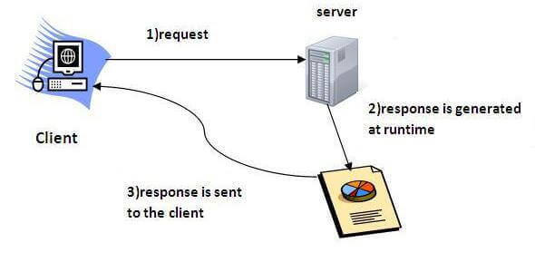

# C# 
### C# is pronounced as "C-Sharp". It is an object-oriented programming language provided by Microsoft that runs on .Net Framework
### By the help of C# programming language, we can develop different types of secured and robust applications:
- Window applications
- Web applications
- Distributed applications
- Web service applications
- Database applications etc.
# C# History
### Anders Hejlsberg is known as the founder of C# language.
### C# has evolved much since their first release in the year 2002. It was introduced with .NET Framework 1.0 and the current version of C# is 5.0.


### In C# programming language, a simple "hello world" program can be written by multiple ways. Let's see the top 4 ways to create a simple C# example:
- 1 . Simple Example
- 2 . Using System
- 3 . Using public modifier

## 1. Simple Example
```c#
class Program  
{  
    static void Main(string[] args)  
    {  
        System.Console.WriteLine("Hello World!");  
    }  
}  
```
#### 1 . Class: is a keyword which is used to define class.
#### 2 . Program: is the class name. A class is a blueprint or template from which objects are created. It can have data members and methods. Here, it has only Main method.
#### 3 . Static: is a keyword which means object is not required to access static members. So it saves memory.
#### 4 . Void: is the return type of the method. It does't return any value. In such case, return statement is not required    
#### 5 . Main: is the method name. It is the entry point for any C# program. Whenever we run the C# program, Main() method is invoked first before any other method. It represents start up of the program.
#### 6 . string[] args: is used for command line arguments in C#. While running the C# program, we can pass values. These values are known as arguments which we can use in the program.
#### 7 . System.Console.WriteLine("Hello World!"): Here, System is the namespace. Console is the class defined in System namespace. The WriteLine() is the static method of Console class which is used to write the text on the console.

## 2. Using System
### If we write using System before the class, it means we don't need to specify System namespace for accessing any class of this namespace

```c#
using System;  
class Program  
{  
    static void Main(string[] args)  
    {  
        Console.WriteLine("Hello World!");  
    }  
} 
``` 
## 3 . Using public modifier
### We can also specify public modifier before class and Main() method. Now, it can be accessed from outside the class also.
```c#
using System;  
public class Program  
{  
    public static void Main(string[] args)  
    {  
        Console.WriteLine("Hello World!");  
    }  
}  
```