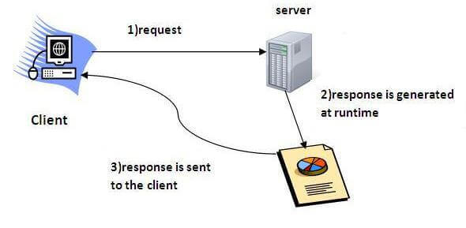

# Servlet
### Servlet technology is used to create a web application
### Servlet is a Java class that is used to extend the functionality of a web server
### Servlet is an interface that must be implemented for creating any Servlet.
### Servlet is a class that extends the capabilities of the servers and responds to the incoming requests. It can respond to any requests.
### Servlet is a web component that is deployed on the server to create a dynamic web page.


# Advantages of Servlet
### 1. Better performance: because it creates a thread for each request, not process.
### 2. Portability: because it uses Java language.
### 3. Robust: JVM manages Servlets, so we don't need to worry about the memory leak, garbage collection, etc.
### 4. Secure: because it uses java language.

# Servlet Interface 
## Servlet interface provides common behaviour to all the servlets.Servlet interface defines methods that all servlets must implement.

### Servlet interface needs to be implemented for creating any servlet (either directly or indirectly). It provides 3 life cycle methods that are used to initialize the servlet, to service the requests, and to destroy the servlet and 2 non-life cycle methods.

# Methods of Servlet interface
### 1. public void init(ServletConfig config) 
    Initializes the servlet.
### 2. public void service(ServletRequest request,ServletResponse response)
    Provides response for the incoming request.
### 3. public void destroy()
    Is invoked only once and indicates that servlet is being destroyed.
### 4. public ServletConfig getServletConfig()
    returns the object of ServletConfig.
### 5. public String getServletInfo()
    returns information about servlet such as writer, copyright, version etc
# 1. First type to create servlet using servlet interface
###    Servlet interface needs to be implemented for creating any servlet (either directly or indirectly). It provides 3 life cycle methods that are used to initialize the servlet, to service the requests, and to destroy the servlet and 2 non-life cycle methods
```java
import java.io.*;  
import javax.servlet.*;  
  
public class First implements Servlet
{  

    ServletConfig config=null;  
    public void init(ServletConfig config)
    {  
        this.config=config;  
        System.out.println("servlet is initialized");  
    } 
    public void service(ServletRequest req,ServletResponse res) throws IOException,ServletException
    {  
        res.setContentType("text/html");  
        
        PrintWriter out=res.getWriter();  
        out.print("<html><body>");  
        out.print("<b>hello simple servlet</b>");  
        out.print("</body></html>");  
    }  
    public void destroy()
    {
        System.out.println("servlet is destroyed");
    }  
    public ServletConfig getServletConfig()
    {
        return config;
    }  
    public String getServletInfo()
    {
        return "copyright 2007-1010";
    }  
  
}  
```
# 2. Second type to create servlet using GenericServlet
### GenericServlet class implements Servlet
### It provides the implementation of all the methods of these interfaces except the service method.
```java
import java.io.*;  
import javax.servlet.*;  
  
public class First extends GenericServlet
{  
    public void service(ServletRequest req,ServletResponse res) throws IOException,ServletException
    {  
        res.setContentType("text/html");   
        PrintWriter out=res.getWriter();  
        out.print("<html><body>");  
        out.print("<b>hello generic servlet</b>");  
        out.print("</body></html>");  
    }  
}  

```
# 3. Third method to create servlet using HttpServlet 
### The HttpServlet class extends the GenericServlet class. It provides http specific methods such as doGet, doPost, doHead, doTrace etc

```java
import javax.servlet.http.*;  
import javax.servlet.*;  
import java.io.*;  
public class Third_3 extends HttpServlet
{  
    public void doGet(HttpServletRequest req,HttpServletResponse res) throws ServletException,IOException  
    {  
        res.setContentType("text/html");//setting the content type  
        PrintWriter out = res.getWriter();  

        //writing html in the stream  
        out.println("<html><body>");  
        out.println("Welcome to servlet");  
        out.println("</body></html>");  
        
        out.close();//closing the stream  
    }
} 

```


```xml
<!-- 
    <web-app> represents the whole application.
    <servlet> is sub element of <web-app> and represents the servlet.
    <servlet-name> is sub element of <servlet> represents the name of the servlet.
    <servlet-class> is sub element of <servlet> represents the class of the servlet.
    <servlet-mapping> is sub element of <web-app>. It is used to map the servlet.
    <url-pattern> is sub element of <servlet-mapping>. This pattern is used at client side to invoke the servlet.
 -->
<web-app>

    <servlet>
        <servlet-name>Third_3</servlet-name> 
        <servlet-class>Third_3</servlet-class>
    </servlet>  
        
    <servlet-mapping>  
        <servlet-name>Third_3</servlet-name>  
        <url-pattern>/Third_3</url-pattern>  
    </servlet-mapping>  
    
</web-app>  
```
># RequestDisptcher In Servlet 
### The RequestDispatcher interface provides the facility of dispatching the request to another resource it may be html, servlet or jsp. This interface can also be used to include the content of another resource also
### There are two methods defined in the RequestDispatcher interface.
###    1. public void forward(ServletRequest request,ServletResponse response)throws ServletException,java.io.IOException:Forwards a request from a servlet to another resource (servlet, JSP file, or HTML file) on the server.
###    2. public void include(ServletRequest request,ServletResponse response)throws ServletException,java.io.IOException:Includes the content of a resource (servlet, JSP page, or HTML file) in the response.
## index.html
```html
<form action="servlet1" method="post">  
    Name:<input type="text" name="userName"/><br/>  
    Password:<input type="password" name="userPass"/><br/>  
    <input type="submit" value="login"/>  
</form> 
```
## login.java
```java

import java.io.*;  
import javax.servlet.*;  
import javax.servlet.http.*;  
  
public class Login extends HttpServlet {  
  
    public void doPost(HttpServletRequest request, HttpServletResponse response) throws ServletException, IOException 
    {  
        response.setContentType("text/html");  
        PrintWriter out = response.getWriter();  
            
        String n=request.getParameter("userName");  
        String p=request.getParameter("userPass");  
          
        if(p.equals("servlet")
        {  
            RequestDispatcher rd=request.getRequestDispatcher("servlet2");  
            rd.forward(request, response);  
        }  
        else
        {  
            out.print("Sorry UserName or Password Error!");  
            RequestDispatcher rd=request.getRequestDispatcher("/index.html");  
            rd.include(request, response);               
        }  
    }  
}  
```
## WelcomeServle.java
```java
import java.io.*;  
import javax.servlet.*;  
import javax.servlet.http.*;  
  
public class WelcomeServlet extends HttpServlet 
{  
    public void doPost(HttpServletRequest request, HttpServletResponse response) throws ServletException, IOException {  

        response.setContentType("text/html");  
        PrintWriter out = response.getWriter();  
            
        String n=request.getParameter("userName");  
        out.print("Welcome "+n);  

    }  
}  
```
## web.xml
```xml
<web-app>  

    <servlet>  
        <servlet-name>Login</servlet-name>  
        <servlet-class>Login</servlet-class>  
    </servlet>  
    
    <servlet>  
        <servlet-name>WelcomeServlet</servlet-name>  
        <servlet-class>WelcomeServlet</servlet-class>  
    </servlet>  
    
    
    <servlet-mapping>  
        <servlet-name>Login</servlet-name>  
        <url-pattern>/servlet1</url-pattern>  
    </servlet-mapping> 

    <servlet-mapping>  
        <servlet-name>WelcomeServlet</servlet-name>  
        <url-pattern>/servlet2</url-pattern>  
    </servlet-mapping>  
    
    <welcome-file-list>  
        <welcome-file>index.html</welcome-file>  
    </welcome-file-list>  

</web-app>  
```
